# 🚀 Rise Together

<div align="center">


### Learn. Build. Grow.

**Empowering the next generation of tech leaders through collaborative learning, innovative projects, and endless possibilities.**

[](https://risetogether.tech)
[](https://www.djangoproject.com/)
[](https://www.python.org/)
[](https://tailwindcss.com/)
[](LICENSE)

[🌐 Live Demo](https://risetogether.tech) • [📖 Documentation](#documentation) • [🐛 Report Bug](https://github.com/risetogethercommunity/rise-together-web/issues) • [✨ Request Feature](https://github.com/risetogethercommunity/rise-together-web/issues)

</div>

---

## 📋 Table of Contents

- [About The Project](#about-the-project)
- [Features](#features)
- [Screenshots](#screenshots)
- [Tech Stack](#tech-stack)
- [Project Structure](#project-structure)
- [Getting Started](#getting-started)
  - [Prerequisites](#prerequisites)
  - [Installation](#installation)
  - [Environment Variables](#environment-variables)
- [Usage](#usage)
- [Roadmap](#roadmap)
- [Contributing](#contributing)
- [License](#license)
- [Contact](#contact)
- [Acknowledgments](#acknowledgments)

---

## 🌟 About The Project

**Rise Together** is a vibrant community platform designed to bring together aspiring developers, tech enthusiasts, and innovators. Our mission is to create a collaborative ecosystem where members can learn new technologies, work on real-world projects, share resources, and grow together as a community.

Whether you're a beginner taking your first steps in programming or an experienced developer looking to mentor others, Rise Together provides the perfect environment to connect, collaborate, and create.

### 🎯 Our Vision

To build the largest and most supportive tech community where knowledge flows freely, projects come to life, and every member has the opportunity to rise together towards their goals.

### 💡 What Makes Us Different

- **Community-Driven Learning**: Learn from peers and mentors in a supportive environment
- **Real-World Projects**: Work on actual projects that make a difference
- **Resource Library**: Access curated learning materials and tools
- **Activity Tracking**: Stay motivated with community challenges and activities
- **Tech Blog**: Stay updated with the latest tech trends and tutorials

---

## ✨ Features

### 🔐 User Authentication & Profiles
- **User Registration & Login** - Secure authentication system
- **Profile Management** - Customizable user profiles with bio, skills, and social links
- **Password Recovery** - Email-based password reset functionality
- **Profile Pictures** - Upload and manage profile images

### 📝 Community Blog
- **Article Publishing** - Share knowledge through blog posts
- **Rich Text Editor** - TinyMCE integration for beautiful content creation
- **Categories & Tags** - Organize content for easy discovery
- **Reading Time Estimation** - Auto-calculated reading time for articles
- **Featured Posts** - Highlight important community content

### 🛠️ Projects Showcase
- **Project Listings** - Browse community projects
- **Project Details** - Comprehensive project information and links
- **Technology Tags** - Filter projects by tech stack
- **Live Demo Links** - Direct links to live projects and repositories

### 🎯 Activities & Events
- **Community Activities** - Track ongoing events and challenges
- **Activity Calendar** - Never miss an important community event
- **Participation Tracking** - Keep track of your involvement
- **Achievement Badges** - Earn recognition for contributions

### 📚 Resource Library
- **Curated Resources** - Access handpicked learning materials
- **Multiple Formats** - Articles, videos, courses, and tools
- **Category Filtering** - Find exactly what you need
- **Community Ratings** - See what the community recommends

### 📧 Contact & Newsletter
- **Contact Form** - Easy communication with the team
- **Newsletter Subscription** - Stay updated with community news
- **Email Notifications** - Get notified about important updates

### 🎨 User Experience
- **Responsive Design** - Perfect experience on all devices
- **Dark Theme** - Easy on the eyes with modern dark UI
- **Glassmorphism Effects** - Beautiful, modern interface design
- **Smooth Animations** - Delightful micro-interactions
- **Fast Loading** - Optimized performance
- **Accessibility** - Built with inclusivity in mind

---

## 📸 Screenshots

<div align="center">

### Homepage & About Section
<table>
  <tr>
    <td width="50%">
      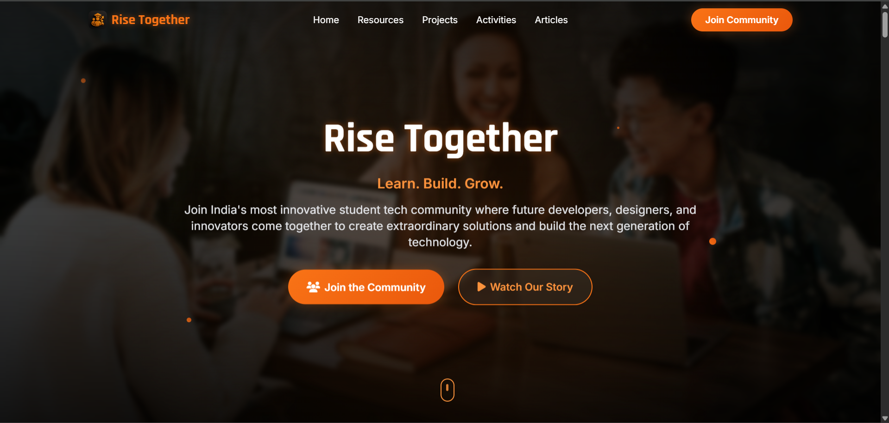
      <p align="center"><em>Beautiful hero section with gradient effects</em></p>
    </td>
    <td width="50%">
      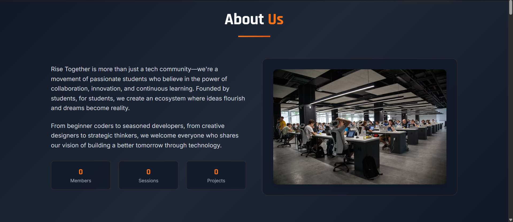
      <p align="center"><em>About section showcasing our mission</em></p>
    </td>
  </tr>
</table>

### Mission & Projects
<table>
  <tr>
    <td width="50%">
      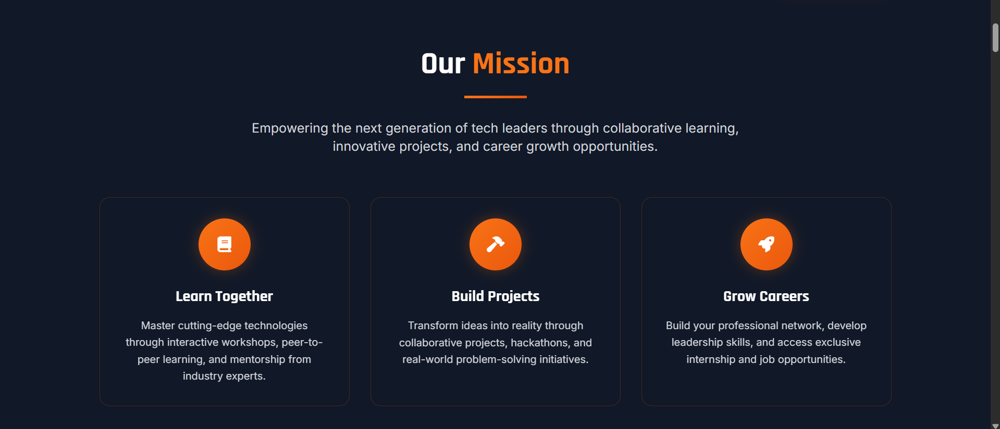
      <p align="center"><em>Our mission and values</em></p>
    </td>
    <td width="50%">
      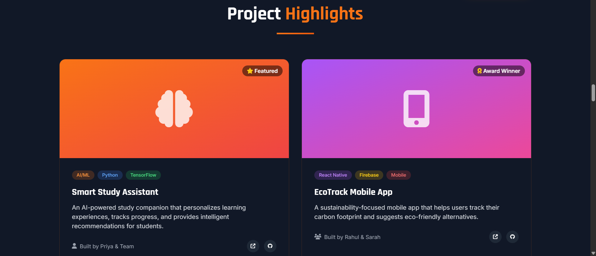
      <p align="center"><em>Community projects with tech tags</em></p>
    </td>
  </tr>
</table>

### Activities & Articles
<table>
  <tr>
    <td width="50%">
      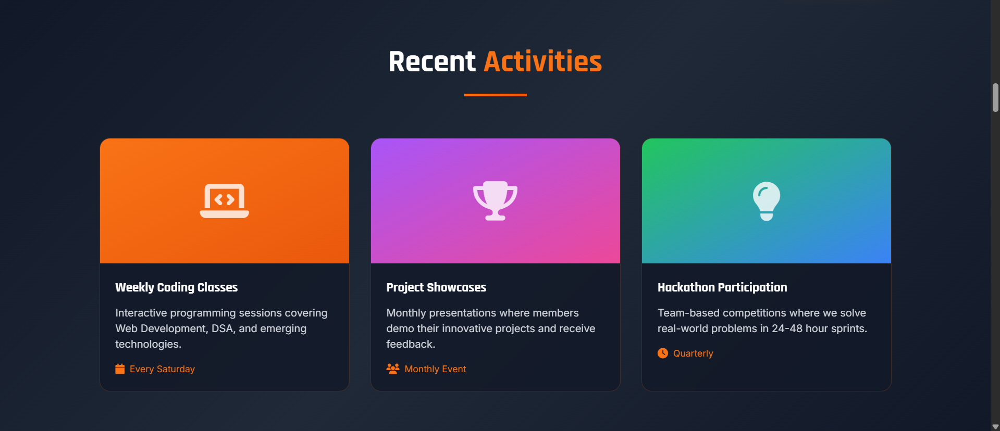
      <p align="center"><em>Track community events and activities</em></p>
    </td>
    <td width="50%">
      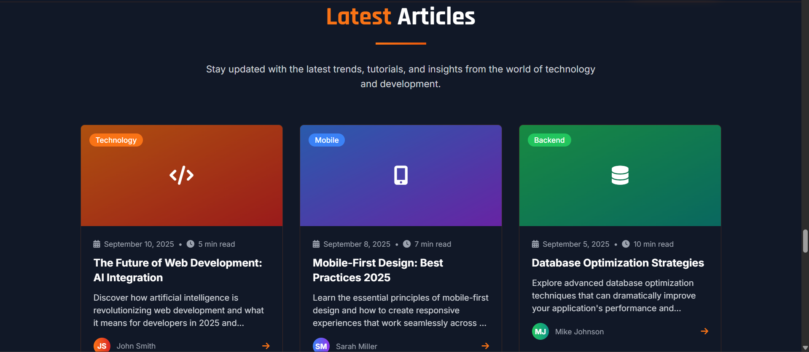
      <p align="center"><em>Read and share knowledge articles</em></p>
    </td>
  </tr>
</table>

### Team & Leaderboard
<table>
  <tr>
    <td width="50%">
      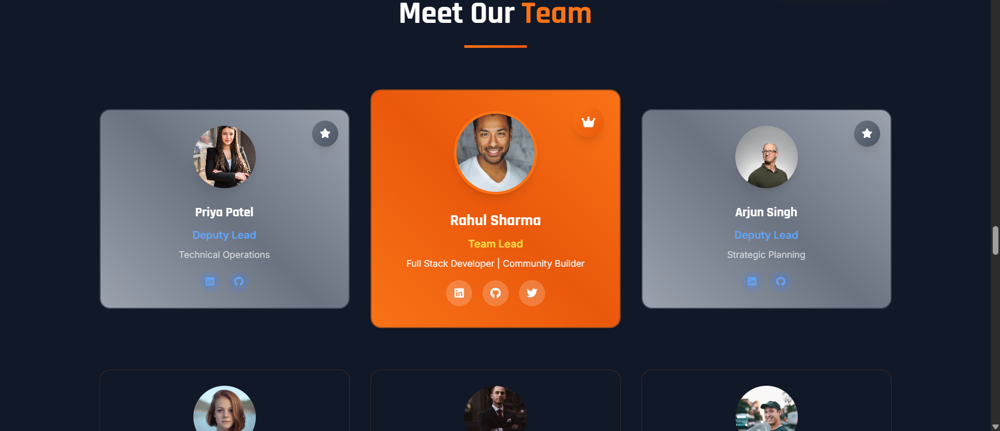
      <p align="center"><em>Meet our amazing team members</em></p>
    </td>
    <td width="50%">
      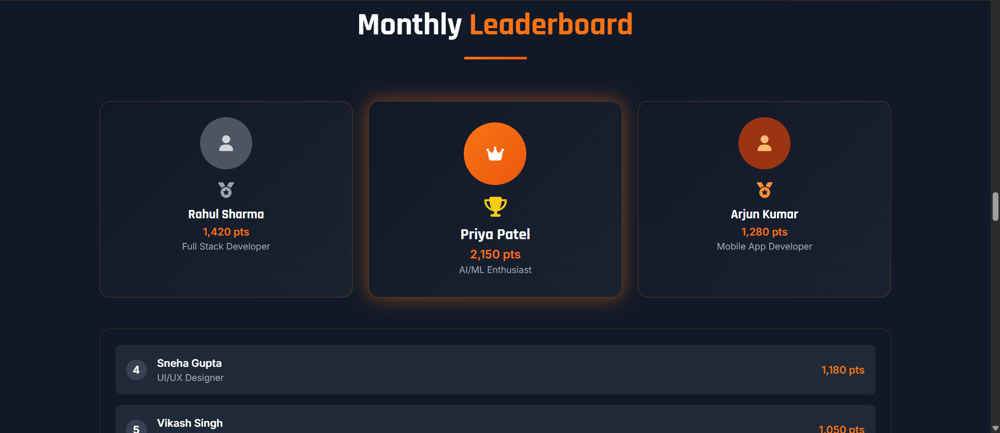
      <p align="center"><em>Community leaderboard and achievements</em></p>
    </td>
  </tr>
</table>

### Achievements & Resources
<table>
  <tr>
    <td width="50%">
      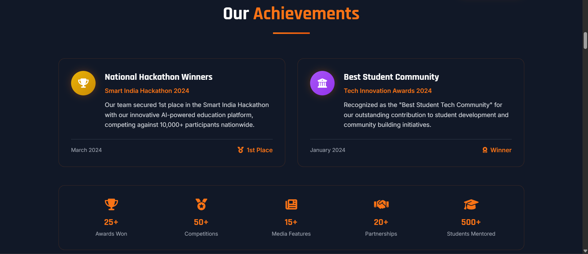
      <p align="center"><em>Track your progress and unlock badges</em></p>
    </td>
    <td width="50%">
      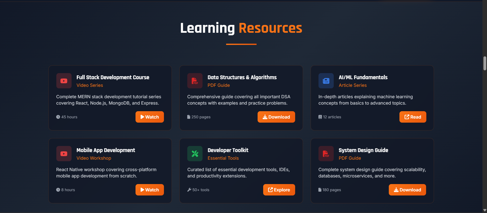
      <p align="center"><em>Curated learning resources</em></p>
    </td>
  </tr>
</table>

### FAQ & Feedback
<table>
  <tr>
    <td width="50%">
      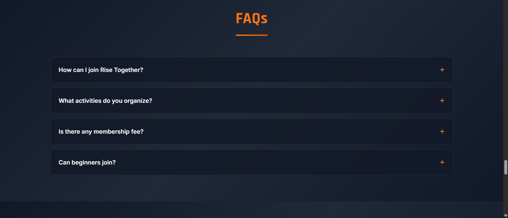
      <p align="center"><em>Frequently asked questions</em></p>
    </td>
    <td width="50%">
      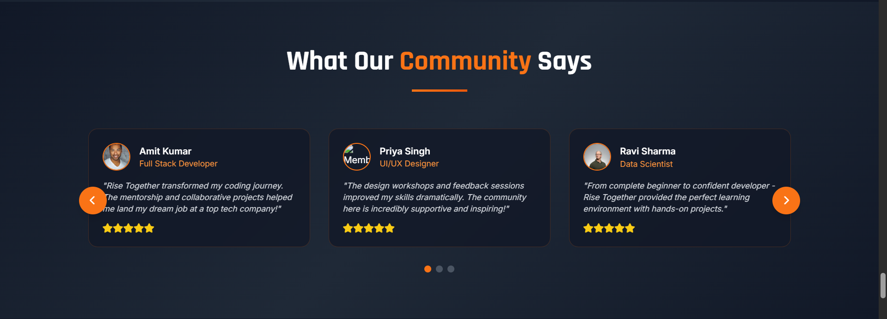
      <p align="center"><em>Share your feedback with us</em></p>
    </td>
  </tr>
</table>

</div>

---

## 🛠️ Tech Stack

### Backend
- **Django 5.2.5** - High-level Python web framework
- **Python 3.8+** - Programming language
- **SQLite3** - Database (development)
- **Django ORM** - Object-relational mapping

### Frontend
- **TailwindCSS** - Utility-first CSS framework
- **Vanilla JavaScript** - Enhanced interactivity
- **Font Awesome** - Icon library
- **Google Fonts** - Rajdhani & Inter typefaces
- **TinyMCE** - Rich text editor

### Tools & Libraries
- **Django Messages** - User notifications
- **Django Static Files** - Asset management
- **Pillow** - Image processing
- **Django Password Reset** - Account recovery

---

## 📁 Project Structure

```
Rise-Together/
│
├── 📁 accounts/                    # User authentication & profiles
│   ├── migrations/                 # Database migrations
│   ├── __init__.py
│   ├── admin.py                    # Admin interface configuration
│   ├── apps.py                     # App configuration
│   ├── forms.py                    # User forms (login, register, profile)
│   ├── models.py                   # User profile model
│   ├── urls.py                     # URL routing for accounts
│   ├── views.py                    # View functions (login, register, profile)
│   └── tests.py                    # Unit tests
│
├── 📁 community/                   # Community features (blogs, projects, activities)
│   ├── migrations/                 # Database migrations
│   ├── __init__.py
│   ├── admin.py                    # Admin configuration for community models
│   ├── apps.py                     # App configuration
│   ├── models.py                   # Blog, Project, Activity models
│   ├── urls.py                     # URL routing for community features
│   ├── views.py                    # View functions for listings
│   └── tests.py                    # Unit tests
│
├── 📁 riseapp/                     # Core application
│   ├── migrations/                 # Database migrations
│   ├── __init__.py
│   ├── admin.py                    # Contact, Newsletter, FAQ admin
│   ├── apps.py                     # App configuration
│   ├── models.py                   # Contact, Newsletter, Testimonial, FAQ models
│   ├── urls.py                     # Main URL routing
│   ├── views.py                    # Homepage and newsletter views
│   └── tests.py                    # Unit tests
│
├── 📁 config/                      # Project configuration
│   ├── __init__.py
│   ├── asgi.py                     # ASGI configuration
│   ├── settings.py                 # Django settings
│   ├── urls.py                     # Root URL configuration
│   └── wsgi.py                     # WSGI configuration
│
├── 📁 static/                      # Static files (CSS, JS, Images)
│   ├── css/
│   │   ├── base.css                # Global styles & animations
│   │   ├── home.css                # Homepage specific styles
│   │   ├── profile.css             # Profile page styles
│   │   ├── auth.css                # Authentication styles
│   │   └── edit_profile.css        # Profile edit styles
│   ├── js/
│   │   └── auth.js                 # Authentication interactions
│   └── images/
│       └── logo.png                # Community logo
│
├── 📁 templates/                   # HTML templates
│   ├── base.html                   # Base template (navbar, footer)
│   ├── home.html                   # Homepage template
│   ├── 📁 accounts/
│   │   ├── join.html               # Registration page
│   │   ├── login.html              # Login page
│   │   ├── profile.html            # User profile page
│   │   ├── edit_profile.html       # Profile editing page
│   │   ├── password_reset.html     # Password reset request
│   │   ├── password_reset_done.html
│   │   ├── reset.html              # Password reset form
│   │   └── password_reset_complete.html
│   └── 📁 Pages/
│       ├── blogs.html              # Blog listing page
│       ├── blog-detail.html        # Individual blog post
│       ├── projects.html           # Projects showcase
│       ├── activities.html         # Community activities
│       └── resources.html          # Learning resources
│
├── 📁 media/                       # User-uploaded files
│   └── profile_pics/               # Profile pictures
│
├── 📁 venv/                        # Virtual environment (not in git)
│
├── db.sqlite3                      # SQLite database
├── manage.py                       # Django management script
├── requirements.txt                # Python dependencies
├── .gitignore                      # Git ignore rules
└── README.md                       # This file
```

---

## 🚀 Getting Started

Follow these steps to get Rise Together running on your local machine.

### Prerequisites

Make sure you have the following installed:

- **Python 3.8 or higher**
  ```sh
  python --version
  ```

- **pip** (Python package manager)
  ```sh
  pip --version
  ```

- **Git**
  ```sh
  git --version
  ```

### Installation

1. **Clone the repository**
   ```sh
   git clone https://github.com/risetogethercommunity/rise-together-web.git
   cd rise-together-web
   ```

2. **Create a virtual environment**
   ```sh
   # Windows
   python -m venv venv
   venv\Scripts\activate

   # macOS/Linux
   python3 -m venv venv
   source venv/bin/activate
   ```

3. **Install dependencies**
   ```sh
   pip install -r requirements.txt
   ```

4. **Apply database migrations**
   ```sh
   python manage.py makemigrations
   python manage.py migrate
   ```

5. **Create a superuser (admin account)**
   ```sh
   python manage.py createsuperuser
   ```

6. **Collect static files**
   ```sh
   python manage.py collectstatic
   ```

7. **Run the development server**
   ```sh
   python manage.py runserver
   ```

8. **Open your browser**
   
   Navigate to `http://127.0.0.1:8000/` to view the application.
   
   Admin panel: `http://127.0.0.1:8000/admin/`

### Environment Variables

Create a `.env` file in the root directory for sensitive information:

```env
SECRET_KEY=your-secret-key-here
DEBUG=True
ALLOWED_HOSTS=localhost,127.0.0.1,risetogether.tech

# Email Configuration (for password reset)
EMAIL_BACKEND=django.core.mail.backends.smtp.EmailBackend
EMAIL_HOST=smtp.gmail.com
EMAIL_PORT=587
EMAIL_USE_TLS=True
EMAIL_HOST_USER=your-email@gmail.com
EMAIL_HOST_PASSWORD=your-app-password

# Database (for production)
DATABASE_URL=your-database-url
```

---

## 💻 Usage

### For Users

1. **Register an Account** - Click "Join Community" to create your profile
2. **Explore Content** - Browse blogs, projects, and resources
3. **Engage** - Comment on posts, join activities
4. **Share** - Write blog posts and showcase your projects
5. **Learn** - Access curated resources and tutorials

### For Developers

1. **Admin Panel** - Manage content at `/admin`
2. **Create Models** - Add new features by extending models
3. **Custom Templates** - Modify templates in `/templates`
4. **Styling** - Edit CSS in `/static/css`
5. **Testing** - Run tests with `python manage.py test`

### Running Tests

```sh
# Run all tests
python manage.py test

# Run specific app tests
python manage.py test accounts
python manage.py test community

# Run with coverage
coverage run --source='.' manage.py test
coverage report
```

---

## 🗺️ Roadmap

### Phase 1: Core Features ✅
- [x] User authentication system
- [x] Profile management
- [x] Blog platform
- [x] Projects showcase
- [x] Resources library
- [x] Contact form & newsletter

### Phase 2: Enhanced Features 🚧
- [ ] Real-time chat system
- [ ] Video tutorials section
- [ ] Project collaboration tools
- [ ] Mentor-mentee matching
- [ ] Skill assessment tests
- [ ] Achievement system

### Phase 3: Advanced Features 📋
- [ ] Live coding sessions
- [ ] Job board integration
- [ ] Community marketplace
- [ ] Mobile application
- [ ] API for third-party integrations
- [ ] Multi-language support

See the [open issues](https://github.com/risetogethercommunity/rise-together-web/issues) for a full list of proposed features and known issues.

---

## 🤝 Contributing

Contributions are what make the open-source community such an amazing place to learn, inspire, and create. Any contributions you make are **greatly appreciated**.

### How to Contribute

1. **Fork the Project**
2. **Create your Feature Branch**
   ```sh
   git checkout -b feature/AmazingFeature
   ```
3. **Commit your Changes**
   ```sh
   git commit -m 'Add some AmazingFeature'
   ```
4. **Push to the Branch**
   ```sh
   git push origin feature/AmazingFeature
   ```
5. **Open a Pull Request**

### Contribution Guidelines

- Follow PEP 8 style guide for Python code
- Write meaningful commit messages
- Add tests for new features
- Update documentation as needed
- Be respectful and inclusive

---

## 📄 License

Distributed under the MIT License. See `LICENSE` for more information.

---

## 📞 Contact

**Rise Together Community**

- 🌐 Website: [risetogether.tech](https://risetogether.tech)
- 📧 Email: contact@risetogether.tech
- 💬 Discord: [Join our server](https://discord.gg/risetogether)
- 🐦 Twitter: [@risetogether](https://twitter.com/risetogether)
- 📘 LinkedIn: [Rise Together](https://linkedin.com/company/risetogether)

**Project Link:** [https://github.com/risetogethercommunity/rise-together-web](https://github.com/risetogethercommunity/rise-together-web)

---

## 🙏 Acknowledgments

Special thanks to all our contributors and supporters:

- [Django](https://www.djangoproject.com/) - The web framework for perfectionists with deadlines
- [TailwindCSS](https://tailwindcss.com/) - A utility-first CSS framework
- [Font Awesome](https://fontawesome.com/) - Icon library and toolkit
- [TinyMCE](https://www.tiny.cloud/) - Rich text editor
- [Unsplash](https://unsplash.com/) - Beautiful free images
- All our community members who make this project possible! ❤️

---

<div align="center">

### ⭐ Star us on GitHub — it motivates us a lot!

Made with ❤️ by the Rise Together Community

[🔝 Back to Top](#-rise-together)

</div>
